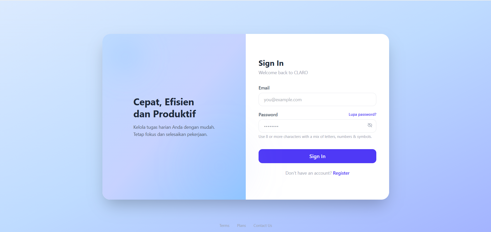
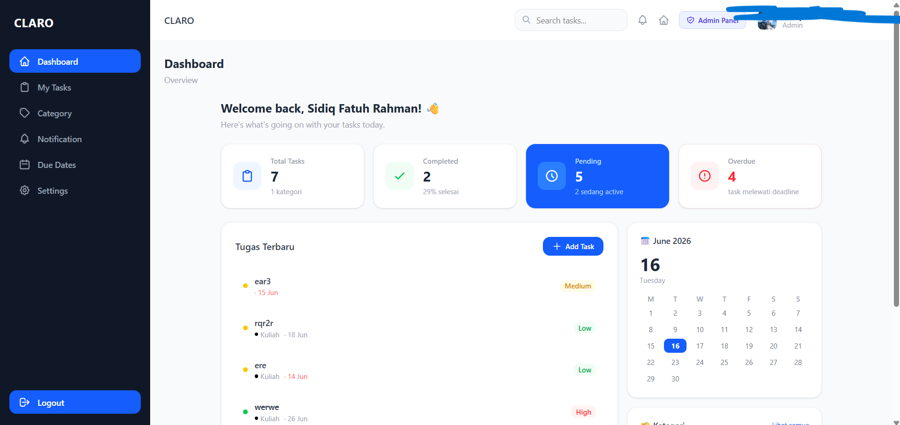

# CLARO — Todo App dengan Reminder Otomatis ke WhatsApp

**CLARO** adalah aplikasi manajemen tugas (to-do list) berbasis web yang mengirim **pengingat deadline otomatis ke WhatsApp** pengguna menggunakan **Fonnte API**. Dibangun dengan Laravel 13, Tailwind CSS v4, dan MySQL, seluruh stack dijalankan dalam Docker sehingga bisa langsung `docker compose up` tanpa instalasi manual PHP/Node/MySQL di mesin lokal.


[](https://github.com/SidiqFatuh187/TodoAPP-Docker/actions/workflows/ci.yml)
[](https://github.com/SidiqFatuh187/TodoAPP-Docker/actions/workflows/cd.yml)

> 💡 Proyek ini dibuat sebagai referensi belajar (Laravel + Docker + integrasi WhatsApp/email API). Bebas dipakai, dipelajari, di-*fork*, atau dikembangkan lebih lanjut — kontribusi lewat Pull Request juga sangat terbuka. Lihat bagian [Kontribusi](#-kontribusi).

---

## 📋 Daftar Isi

- [Tentang Proyek](#-tentang-proyek)
- [Tampilan Aplikasi](#-tampilan-aplikasi)
- [Fitur Utama](#-fitur-utama)
- [Cara Kerja Reminder WhatsApp](#-cara-kerja-reminder-whatsapp)
- [Tech Stack](#-tech-stack)
- [Arsitektur Docker](#-arsitektur-docker)
- [Struktur Proyek](#-struktur-proyek)
- [Instalasi & Menjalankan](#-instalasi--menjalankan)
- [Environment Variables Penting](#-environment-variables-penting)
- [Menjalankan Scheduler (Reminder)](#-menjalankan-scheduler-reminder)
- [Testing & CI/CD](#-testing--cicd)
- [Roadmap](#-roadmap)
- [Kontribusi](#-kontribusi)
- [Lisensi](#-lisensi)

---

## 📌 Tentang Proyek

CLARO membantu pengguna mencatat tugas lengkap dengan kategori, prioritas, dan deadline, lalu secara otomatis **mengingatkan lewat WhatsApp** setiap ada tugas yang mendekati atau melewati deadline — tanpa perlu buka aplikasi. Cocok untuk kebutuhan personal task management yang notifikasinya ingin langsung nyampe di HP, bukan cuma badge notifikasi di web.

Aplikasi ini juga dilengkapi panel admin, reset password via OTP (email), dan pencatatan aktivitas (activity log) untuk keperluan audit.

## 🖼️ Tampilan Aplikasi

| Halaman Login | Dashboard |
|---|---|
|  |  |

- **Sign In** — halaman login dengan email & password, plus link *Lupa password* (reset via OTP email) dan link ke halaman Register.
- **Dashboard** — ringkasan Total Tasks, Completed, Pending, dan Overdue, daftar tugas terbaru, kalender bulan berjalan, serta akses cepat ke Admin Panel bagi user dengan role admin.

## ✨ Fitur Utama

### 🗂️ Manajemen Tugas (Todo)
- CRUD tugas lengkap: judul, deskripsi, kategori, prioritas (`low` / `medium` / `high`), status (`pending` / `active` / `completed`), dan deadline
- Lampiran file per tugas (pdf, doc, docx, xls, xlsx, jpg, png — maks. 5 MB)
- Pencarian & filter tugas berdasarkan status, kategori, atau kata kunci (termasuk quick search via AJAX)
- Kategori kustom dengan warna & ikon per user
- Halaman **Due Dates** yang mengelompokkan tugas ke: **Terlambat**, **Hari Ini**, **Besok**, dan **Nanti**

### 📲 Reminder Otomatis ke WhatsApp (Fonnte)
- Notifikasi WhatsApp otomatis untuk tugas yang **overdue**, **deadline hari ini**, dan **deadline besok (H-1)**
- Pesan WhatsApp berformat rapi (nama user, judul tugas, prioritas, jam deadline)
- Mendukung 3 zona waktu Indonesia per user: **WIB, WITA, WIT** — pengingat dihitung sesuai timezone masing-masing user, bukan waktu server
- Anti duplikat: sistem mengecek riwayat notifikasi sebelum mengirim ulang pesan yang sama
- Notifikasi juga tersimpan di database (in-app notification center), tidak hanya dikirim ke WhatsApp

### 🔐 Autentikasi & Keamanan
- Register, Login, Logout
- Reset password via **kode OTP yang dikirim ke email** (menggunakan Resend API)
- Middleware pengecekan akun yang di-banned (`CheckBanned`)

### 🔔 Notifikasi In-App
- Pusat notifikasi (list, tandai semua terbaca, hapus satu/semua)

### 👤 Profil & Pengaturan
- Edit profil (nama, no. HP, bio, avatar), ganti password
- Pengaturan zona waktu (WIB/WITA/WIT) yang memengaruhi jadwal reminder

### 🛠️ Panel Admin
- Dashboard ringkasan (jumlah user, tugas, user baru minggu ini, dll.)
- Kelola pengguna (ban / unban)
- Kelola seluruh tugas & kategori semua user
- Activity log (lihat & hapus log aktivitas user)
- Export data user ke CSV

### 🧾 Activity Logging
- Pencatatan aktivitas otomatis lewat Laravel event listener (`LogTaskActivity`, `LogUserActivity`) untuk jejak audit

## ⏰ Cara Kerja Reminder WhatsApp

Inti fitur reminder ada di command `app:send-task-notifications`, dijadwalkan berjalan **setiap hari jam 07:00 WIB** melalui Laravel Scheduler:

```php
// routes/console.php
Schedule::command('app:send-task-notifications --timezone=Asia/Jakarta')->dailyAt('07:00');
```

Setiap kali dijalankan, command ini memproses 3 jenis pengingat untuk semua tugas yang belum `completed`:

| Jenis Reminder | Kondisi | Notification Class |
|---|---|---|
| 🚨 **Overdue** | Deadline sudah lewat dari hari ini (sesuai timezone user) | `TaskOverdue` |
| 📅 **Hari Ini (H0)** | Deadline jatuh tepat hari ini | `TaskDueTodayReminder` |
| ⏰ **Besok (H-1)** | Deadline jatuh besok | `TaskDeadlineReminder` |

Alur pengirimannya:
1. Command mengambil tugas yang memenuhi kondisi di atas, per-batch (`chunk(100)`) agar hemat memori.
2. Untuk tiap tugas, sistem mengecek dulu apakah notifikasi jenis yang sama untuk `task_id` tersebut **sudah pernah dikirim** (dicek dari tabel `notifications`) — supaya tidak ada pesan dobel.
3. Jika belum, Laravel Notification dipicu lewat `$user->notify(...)`, yang jalan di 2 channel:
   - `database` → tersimpan di pusat notifikasi in-app
   - `App\Channels\WhatsappChannel` (custom channel) → hanya aktif jika user punya nomor HP (`phone`) terisi
4. `WhatsappChannel` memanggil method `toWhatsapp()` pada notification, yang menyusun pesan lalu mengirimnya via HTTP POST ke **Fonnte API**:

```php
Http::withHeaders([
    'Authorization' => config('services.fonnte.token'),
])->post(config('services.fonnte.url'), [
    'target'  => $notifiable->phone,
    'message' => $message,
]);
```

> **Catatan analisis:** Berdasarkan kode saat ini, level pengingat yang sudah aktif terjadwal adalah **Overdue, Hari-H, dan H-1**. Halaman *Due Dates* di UI sudah menyiapkan pengelompokan `overdue / today / tomorrow / later`, tapi command scheduler untuk reminder **H-7 belum ada** — lihat bagian [Roadmap](#-roadmap) jika ingin menambahkannya.

## 🧱 Tech Stack

| Layer | Teknologi |
|---|---|
| Backend Framework | Laravel 13 (PHP 8.4 via `php:8.4-fpm`) |
| Frontend | Tailwind CSS v4 + Vite (`@tailwindcss/vite`) |
| Database | MySQL 8.0 |
| Notifikasi WhatsApp | [Fonnte API](https://fonnte.com) (custom notification channel) |
| Email / OTP | [Resend](https://resend.com) via package resmi `resend/resend-laravel` |
| Queue | Laravel Queue (driver `database`) |
| Web Server | Nginx (reverse proxy ke PHP-FPM) + Nginx Proxy Manager |
| Container | Docker & Docker Compose |
| CI/CD | GitHub Actions → build image → push ke GitHub Container Registry (GHCR) |

## 🐳 Arsitektur Docker

`docker-compose.yml` menjalankan 4 service:

| Service | Image / Build | Port | Fungsi |
|---|---|---|---|
| `nginx-proxy-manager` | `jc21/nginx-proxy-manager` | `80`, `443`, `81` | Reverse proxy + panel manajemen SSL/domain |
| `nginx` | `nginx:alpine` | `8000` → `80` | Web server, meneruskan request PHP ke container `php` |
| `php` | Custom (`docker/php/Dockerfile`, base `php:8.4-fpm`) | `5173` (Vite dev server) | Menjalankan aplikasi Laravel, Composer, Node.js 22 & npm sudah terpasang di image |
| `mysql` | `mysql:8.0` | `3306` (localhost only) | Database utama (`todo_db`) |

Semua service terhubung lewat network bridge `todo_network`, dengan volume persisten untuk data MySQL dan konfigurasi Nginx Proxy Manager.

## 📁 Struktur Proyek

```
TodoAPP-Docker/
├── docker/
│   ├── nginx/default.conf      # Konfigurasi virtual host Nginx
│   └── php/Dockerfile          # Image PHP 8.4-fpm + Node.js 22 + ekstensi Laravel
├── docker-compose.yml          # Definisi service: nginx-proxy-manager, nginx, php, mysql
├── src/                        # Source code Laravel
│   ├── app/
│   │   ├── Channels/WhatsappChannel.php       # Custom notification channel → Fonnte
│   │   ├── Console/Commands/SendTaskNotifications.php  # Logic reminder terjadwal
│   │   ├── Notifications/                     # TaskOverdue, TaskDueTodayReminder, TaskDeadlineReminder
│   │   ├── Mail/OtpMail.php                    # Email OTP reset password (Resend)
│   │   ├── Http/Controllers/                   # Todo, Category, DueDate, Admin, Profile, dst.
│   │   ├── Models/                             # User, Todo, Category, ActivityLog
│   │   └── Listeners/                          # LogTaskActivity, LogUserActivity
│   ├── database/migrations/    # users, todos, category, notifications, activity_logs, dll.
│   ├── resources/views/        # Blade views (dashboard, todo, admin, auth, dll.)
│   └── routes/
│       ├── web.php             # Semua endpoint aplikasi
│       └── console.php         # Jadwal scheduler reminder
└── .github/workflows/
    ├── ci.yml                  # Test otomatis (PHPUnit + build asset)
    └── cd.yml                  # Build & push image Docker ke GHCR
```

## 🚀 Instalasi & Menjalankan

### Prasyarat
- Docker & Docker Compose
- Akun [Fonnte](https://fonnte.com) (untuk token pengiriman WhatsApp)
- Akun [Resend](https://resend.com) (untuk pengiriman email OTP)

### Langkah-langkah

```bash
# 1. Clone repository
git clone https://github.com/SidiqFatuh187/TodoAPP-Docker.git
cd TodoAPP-Docker

# 2. Siapkan file environment Laravel
cp src/.env.example src/.env
```

Edit `src/.env`, sesuaikan minimal bagian berikut (default `.env.example` masih mengarah ke SQLite, sedangkan `docker-compose.yml` menyediakan MySQL — jadi wajib diganti):

```env
DB_CONNECTION=mysql
DB_HOST=mysql
DB_PORT=3306
DB_DATABASE=todo_db
DB_USERNAME=todo_user
DB_PASSWORD=todo_pass

MAIL_MAILER=resend
RESEND_API_KEY=your_resend_api_key
MAIL_FROM_ADDRESS=noreply@yourdomain.com

FONNTE_TOKEN=your_fonnte_device_token
FONNTE_URL=https://api.fonnte.com/send
```

```bash
# 3. Build & jalankan seluruh container
docker compose up -d --build

# 4. Install dependency PHP
docker compose exec php composer install

# 5. Generate application key
docker compose exec php php artisan key:generate

# 6. Jalankan migrasi database
docker compose exec php php artisan migrate

# 7. Buat symlink storage (dibutuhkan untuk lampiran file & avatar)
docker compose exec php php artisan storage:link

# 8. Install dependency & build asset frontend (Tailwind v4 + Vite)
docker compose exec php npm install
docker compose exec php npm run build
```

Aplikasi bisa diakses di **http://localhost:8000**.

> Untuk mode development dengan hot-reload Vite, jalankan `npm run dev` di dalam container `php` (port `5173` sudah di-expose di `docker-compose.yml`).

## ⚙️ Environment Variables Penting

| Variabel | Keterangan |
|---|---|
| `DB_CONNECTION`, `DB_HOST`, `DB_DATABASE`, `DB_USERNAME`, `DB_PASSWORD` | Kredensial MySQL, samakan dengan yang didefinisikan di `docker-compose.yml` |
| `MAIL_MAILER=resend`, `RESEND_API_KEY` | Konfigurasi pengiriman email OTP reset password lewat Resend |
| `FONNTE_TOKEN` | Token device dari dashboard Fonnte, dipakai sebagai header `Authorization` |
| `FONNTE_URL` | Endpoint API Fonnte, default `https://api.fonnte.com/send` |
| `QUEUE_CONNECTION=database` | Notifikasi menggunakan queue, pastikan tabel `jobs` termigrasi dan ada worker aktif |
| `APP_TIMEZONE` | Timezone default aplikasi; timezone per-user (WIB/WITA/WIT) diatur lewat halaman Settings |

## 📅 Menjalankan Scheduler (Reminder)

Reminder WhatsApp dikirim lewat Laravel Scheduler, yang butuh proses berjalan terus-menerus. Docker Compose bawaan di repo ini **belum** menyertakan container terpisah untuk scheduler, jadi pilih salah satu cara berikut di container `php`:

```bash
# Opsi 1 — untuk development, cron-like loop bawaan Laravel
docker compose exec php php artisan schedule:work

# Opsi 2 — untuk production, tambahkan cron job di host/server (setiap menit)
* * * * * docker compose exec -T php php artisan schedule:run >> /dev/null 2>&1
```

Karena notifikasi memakai `ShouldQueue`/queue database, pastikan juga ada queue worker yang berjalan:

```bash
docker compose exec php php artisan queue:work
```

## 🧪 Testing & CI/CD

- **CI** (`.github/workflows/ci.yml`): setiap push/PR ke `master` menjalankan `composer install`, build asset (`npm run build`), migrasi ke SQLite, lalu `php artisan test`.
- **CD** (`.github/workflows/cd.yml`): setelah CI sukses di branch `master`, image Docker PHP di-build dari `docker/php/Dockerfile` dan di-push otomatis ke **GitHub Container Registry (GHCR)**.

## 🗺️ Roadmap

Beberapa ide pengembangan lanjutan:

- [ ] Tambahkan level reminder **H-7** (pengingat 7 hari sebelum deadline) pada `SendTaskNotifications`
- [ ] Tambahkan container/service khusus untuk scheduler & queue worker di `docker-compose.yml` (saat ini masih manual)
- [ ] Preferensi channel notifikasi (WhatsApp / Email / keduanya) yang bisa diatur user sendiri
- [ ] Retry & logging kegagalan pengiriman Fonnte (saat ini response API tidak diperiksa)

## 🤝 Kontribusi

Proyek ini terbuka digunakan sebagai **referensi belajar** — silakan di-*clone*, *fork*, dipelajari struktur kodenya, atau dijadikan starter untuk proyek lain.

Kontribusi lewat Pull Request juga sangat diterima, baik untuk:
- Perbaikan bug
- Fitur baru (mis. reminder H-7, channel notifikasi tambahan)
- Peningkatan dokumentasi

Untuk perubahan besar, disarankan membuka *issue* terlebih dahulu untuk mendiskusikan apa yang ingin diubah sebelum mulai mengerjakan PR.

## 📄 Lisensi

Proyek ini menggunakan lisensi **MIT** — lihat file [LICENSE](LICENSE) untuk detail lengkap. Bebas digunakan, dimodifikasi, dan didistribusikan ulang, termasuk untuk keperluan komersial, selama menyertakan atribusi lisensi asli.
